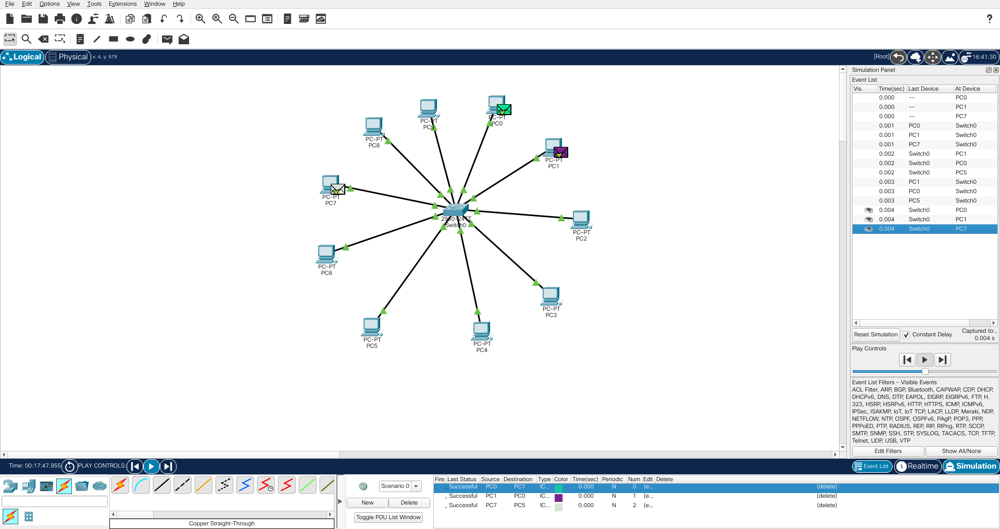

# How internet Works?

Learning From [FreeCodeCamp](https://youtu.be/zN8YNNHcaZc)

## Switch Devices and why we need it?

> - Switch is used to accomplish the communication between two or more computers in same environment.
>
> - In order to connect these computers we generally use a Copper cables and type of this cable is CAT 5
>   or CAT 6 in small environment. ( CAT 6 > CAT 5)(CAT = Catergory.)Fibre optic cables are also used.
>
> - Fibre Optic Cables are faster than Copper cables in Data Transmission.
>
> - Wireless Technology cannot be used in Switch.but can be used in access point devices.
>
> - when we connect switch and computers with cables we created a network. and all these computers are said to be in they are in same network.(LAN)
>
> - LAN: Local Area Network is a computer network which connects computers to communicate with each other in restricted area.
>
> - to Create LAN use Switch.
>
> - when a Any pc wants to send message(Packet/Frame) to other pc.First that packet is send to switch and then switch opens that packet in order to see destination
>   and then sends to destination.
>
> - when one computer can send packet to other they are said to be in same network.

## Router Devices and why we need it?

> - Switch Devices helps to communicate different devices but to enable this devices to connect with internet we need router.
>
> - The main task of router is to enable computers to connect with the Internet,connect different networks and location of these network doesn't matter.
>
> - In order to connect device with internet, we connect device and switch with cable, switch and router is connected through copper cable and lastly Router is
>   connected with cable provided by Internet service provider.
>
> - when Any pc wants to send message(Packet/Frame) to Internet.First that packet is send to switch then to the router which delivers the packet from LAN
>   to the Internet.
>
> - When any device can send packet to internet that means that device can now communicate with Internet.

## What does the internet Represent?

> - Router is a device which can establish communication between Different LAN in different Places.
>
> - Connecting computer to Internet means connecting to another computer anywhere in world.
>
> - The Structure that connects all the LANs in the world is the Internet.
>
> - Structure of internet consist of Tons of Routers and other devices and this routers are distributed around the world in organised manner.

### - Why there are so many of Routers?

> 1. To answer these lets say we have one gaint Router in middle of earth and all the LANs are connected to internet via these router.
>
> 2. As all LANs are connected means all are in Same network.
>
> 3. Lets say if the gaint router brokes.This will create a Problem in Whole earth.
>
> 4. And think of place which is farthest from these router will required a very long cable.
>
> 5. If Internet uses only one Router then,this will overload the router.
>
> 6. If All LAN's Are connected to one router it will create a Mess.To Minimise it we use Distributed Structure.
>
> 7. If any of Routers broke in distributed Structure, efficiency for data transmission gets less but it will solve the single point of Failure problem.
>
> 8. To Avoid All these we use So many Routers instead.

### - What are Home-Routers?

> 1. Home Router is a combo of Switch and Router and can be only used when there is limited number of devices.

### - How to Visualise Internet and how it Looks like in Real Life?

Checkout [here](https://www.infrapedia.com/app)

> - Colourful Lines you see are the Fibre Optic Cables which are placed under water deep down these allows us to communicate between two different continents.
>
> - Copper Cables aren't used because its data Transmission is slow comparatively and as the length of copper cables increases data Transmission error increases.
>   so we use Fibre optic Cables to solve this.

### - How Packet Moves over the Internet?

> - Lets say we want to send a packet from LAN1 to LAN2 over the internet.
>
> - For this, Packet from LAN1 to go to the Switch and it will open up and learns the destination address and understands that it needs to send to the router.
>
> - When packet reaches router it will see the content and learns the Destination address and understands that it needs to send to the Internet.
>
> - Router sends Packet to the Key Router Present in Internet Structure.
>
> - As it reaches the Key router it Learns the Destination Address and choose Path According to the Information which is in Routing Table. (Called Forwading in Technical Terms.)
>
> - Every router has Special table called Routing Table.Which Helps router to choose appropriate path.
>
> - There is special processor inside router.These Processor creates routing table on basis of some complex Algorithm and output of Algorithm is stored in Routing Table.
>
> - So everytime it passes packet to different router it will learn destination address and choose path according to the Routing Table.
>
> - Note that Router always trys to send packet as fast as possible it doesn't choose the shortest path everytime.Other factors like Congestion Control(to avoid Traffic) are also taken care of
>   by processor inside.
>
> - At the end it will reach to the Key Router of LAN2 from that it will pass to the LAN2 (device).

## Connecting to the Internet From a Computer's Perspective

> - So lets say your computer right now is connected to home-router and there are no other device connected to it.
>
> - Means we are just using the Router feature of Home-router.
>
> - This Home-router Allows us to connect to internet.
>
> - So lets say you opened udemy.com and press enter and you got the udemy home-page but What are those Abstract things happening behind lets understand it.
>
> - So when you open/click-on any website computer Generates packet.This packet is send to the servers of udemy.com over the internet.
>
> - In other terms we are requesting the servers over the internet.
>
> - so when servers receive the request,as per the request, server sends the response in form of small pieces of packets and how fast that packet will reach depends on our internet speed.
>
> - Like in udemy.com when we click on video, server send small pieces of packets it doesn't send the entire video directly.This is called Streaming.
>
> - With the help of Streaming Technology if we want to watch an hour long video without download we can watch it at that moment.
>
> - Servers are powerful Computers which Fundamentally same as of normal Computer but it is much faster as it can respond to lot of devices at a same time.
>
> - Servers having same information (udemy servers) Actually are distributed around the world and due to this we solve the single point of failure and provide load balancing.
>
> - Thus, We communicate with that server which is best suitable for us as per our location.

## Wide Area Network (WAN)

> - WAN is a network consisting of combination of Different LANs.
>
> - Lets understand this with Eg.Lets say we have a growing company and we opened up some offices at different parts of world and we want that all this offices should be on same network even if they are in far apart.
>
> - This is where WAN comes into play,by WAN we can create speical network for our requirements.
>
> - So lets say there are Two LANs and our boss wants that We need to create WAN so that both offices devices work as if they are on same environment.
>
> - But We discuss before that if we want devices in diffrent LAN's communicate with each other then we can use internet. Then why we need WAN?

### - Why we need WAN?

> - Communication of LANs over a internet and Special WAN is a Whole Different Thing.
>
> - Internet is Public Network and can be used by anyone, anywhere and anytime.This public network can have Security Related Problems in information Transferred
>   Between different Location. Hackers are everywhere in this Public Network too.
>
> -- For Eg: Lets say you want to send one important file within the same office/LAN from one device to another then this process of sending file is secure operaion
> cause any outsider cannot access your network without your permission in general.
>
> -- But now lets say you want to send that important file to other office device over the internet.This isn't safe cause there is no gaurantee that anyone can't see
> your file or make changes to your file. Hackers are everywhere and there is high chances of this problem.so solution for this is to create the Special WAN for a company.
>
> - In general Setting up WAN is costly and not a easy task but fortuanately there are various methods to setting up a WAN.
>
> - WAN by using VPN is most popular and cost effective.

### - Setting up WAN using Virtual Private Network(VPN)

> - People often use VPN to access restricted Websites because it ensures anonymity and it encrypts the data before sending the packet.
>   Hence it gives us high Security in General.
>
> - While Creating WAN using VPN we take advantage of Features of VPN and Important Feature of VPN which we should know is Tunneling.
>
> - The Tunneling Feature of the VPN Provides us Privacy,anonymity and security by creating a special network connection over the public network.
>
> - Tunneling Technology Makes the packet acts as if it is going through a physical tunnel.
>
> - Tunneling just represent high security connection between two different LANs.
>
> - When packet is send over the internet offcourse it will pass through many routers to reach its destination as learned before but Tunneling makes it impossible
>   to interfere with this packet from outside hence security is maximum.

### - Deeper Look at WAN using VPN

> - So lets say we want to send file from one LAN to Other.When Packet reaches the Router of same LAN from where it send their will be some changes in file.but before
>   that we should note and know that Tunneling is set up between Routers of Two Different LANs and this is called Site to Site VPN.It is very popular while setting up
>   WANs using VPN.
>
> - So lets use analogy for understanding this.so Say you want to send a letter from LAN1 to LAN2 for that letter will be carried by postman.
>   but what if you don't put that letter in envelope than postman can read this right? if We put that letter in envelope chances of reading it are less but still
>   their is no guarantee he can't cause he can open and read it.
>
> - In same way in real Scenario Packet are put inside the another packet but as got it from above their are still risk of Security.
>
> - Hence,Even though we have Increased the Security their is still risk.And this is where Encryption come into play.
>
> - Encryption is very important so what we do is First we encrypt the packet and then put it into another packet.Thus even if someone in between interferes they
>   won't understand the packet information.
>
> - We Encrypt the information in such a way that only the people working in same company will understand.
>
> - Thus,we can send the packet to two different LANs and we maximised the security of packet.
>
> - Tunneling is Special Encapsulation Method and the word Tunneling came because the packet is safe as if it moves from its physical/Private Tunnel.
>
> - So When the Packet Reaches at Router of Destination LAN first it eliminates the outer packet then it decrpyts the original packet and
>   then it learns the destination and sends it to destination.
>
> - There is no such 100% security.every system has vulnerability. but till now WAN networks using VPN are satisfactory in terms of budget as well as security.

## End to end Encryption

> - So the question is We use Internet daily we send mails,Purchase goods from E-commerce through credit card.Is it Insecure? answer is Yes and No.
>   End to end Encryption allows us to be safe from malicious. Only receiver can decrypt that packet.Thus it provides Security.
>
> Eg: Whatsapp

## Few Real World use Case of Network Devices:

> - Lets say Two Office belonging to same company are 100m(short distance) far from each other and we want these two offices as they are in same environment/network.
>   How can we do that?
>
> - Can We Connect Both LANs Switch with cables? Yes offcourse as the distance is short we can connect and make these devices of two offices communicate with each other.
>
> - Thus,We can create Single LAN by connecting 2 switches together.
>
> - These types of LAN is called Campus Area Network(CAN) Cause such special type of LAN are used in University Campuses.
>
> -On the other hand we can also connect these offices using WAN with VPN.

### - Which is more Secure LAN or WAN?

> - LAN is more Secure cause no one can interfere from outside without permission and packet never passes over public network while in WAN even though
>   the packet uses Tunneling and has Encryption there is no guarantee cause there is nothing like 100% Security.

> - Thus Both are Secure but LAN is more Secure.

> There is a condition that WAN is almost secure as WAN its called Private WAN.In these we request(purchase) the Line between two offices from the ISP with special amount.
> ISP gives the private line which only your company can use.Generally its very costly and average company should use Public WAN.

## What is Internet Service Provider (ISP)

> - ISP is responsible for Tranmission of packet from one location to another. We can think as ISP is the mechanism that controls all these routers in Internet Stucture.